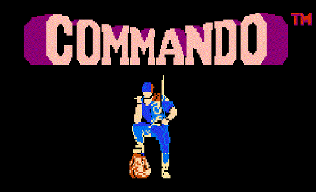

# Commando 

## By gets-name-

Commando is a shoot and run, vertically scrolling arcade game released in 1985. It’s one of the most influenceable games of this genre. This game was realized in various home consoles and home computers. The game was very famous when it was released and it appears on different known consoles as Capcom Classics Collection, Activision Anthology, and on the Wii Virtual Console Arcade, as well as Capcom Classics Collection Arcade Cabinet for Play Station 3 and Xbox 360.

The plot is about a soldier named Super Joe who starts being dropped off in a jungle by helicopter, and has to fight his way out singlehandedly, fending off a massive assault of enemy soldiers.

Gets(name); had created a version of the original Commando Nes level 1-1 full implemented.

video.

# Compilation gets(name);

Sandra Alvarez responsability and GitHub account:

•	Management.

•	GitHub: [Sandruski](https://github.com/Sandruski)

Aleix Castillo responsability and GitHub account:

•	QA.

•	GitHub: [AleixCas95](https://github.com/AleixCas95)

Guillem Costa responsability and GitHub account:

•	Art.

•	GitHub: [DatBeQuiet](https://github.com/DatBeQuiet)

Aleix Gabarró responsability and GitHub account:

•	Code.

•	GitHub: [AleixGab](https://github.com/aleixgab)

# Game controls
~~~~~~~~~~
Player 1:

W: move foward
A: move left
S: move backward
D: move right

SPACE: shoot the sub-machine gun
SHIFT: throw grenades foward

Playe 2:

W: move foward
A: move left
S: move backward
D: move right

SPACE: shoot the sub-machine gun
SHIFT: throw grenades foward
~~~~~~~~~~~~

# [CKHECK GAMEPLAY VIDEO](https://www.youtube.com/watch?v=0fKg7e37bQE)

# Download the lastet version of Commando [here](https://github.com/Sandruski/gets-name-/releases)!

# Check our Github Repositorie [here](https://github.com/Sandruski/gets-name-)!

# See more information in the [Commando Wiki](https://github.com/Sandruski/gets-name-/wiki)! 
