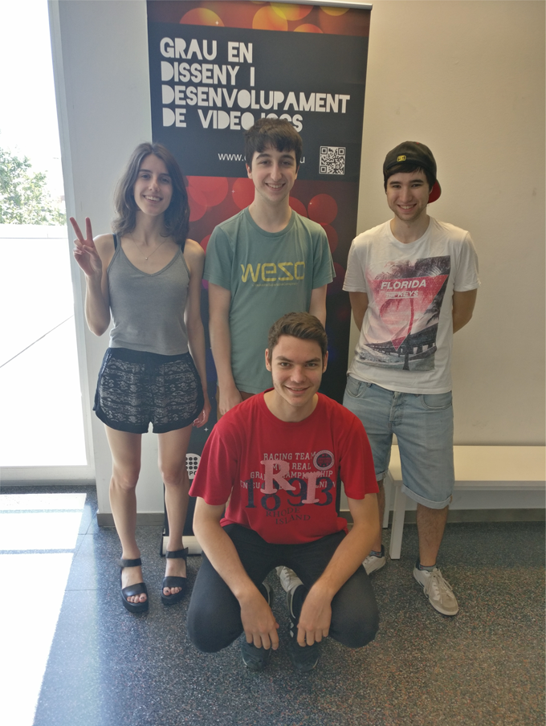
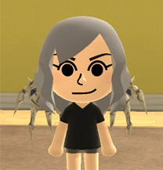

# Commando 

### By gets-name-

Commando is a shoot and run, vertically scrolling arcade game, which was released in 1985. Many versions of the game were released for consoles and home computers. The game also appears on Capcom Classics Collection, Activision Anthology, and on the Wii Virtual Console Arcade, as well as Capcom Classics Collection Arcade Cabinet for Play Station 3 and Xbox 360.

The plot is about a soldier named Super Joe who starts being dropped off in a jungle by helicopter, and has to fight his way out singlehandedly, fending off a massive assault of enemy soldiers. In the game, you have a sub-machine gun with unlimited ammunition as well as a limited supply of hand grenades. Use wisely your skills if you don't want to be killed and DESTROY THE ENEMY ARMY!!!

# Our tribute to the original Commando NES. Level 1-1 fully implemented

<iframe width="740" height="590" src="https://www.youtube.com/embed/4v4mFhaUTOI?ecver=1" frameborder="0" allowfullscreen></iframe>

 

# Compilation gets(name);

### Sandra Alvarez  
responsability and GitHub account:

•	Management.

•	GitHub: [Sandruski](https://github.com/Sandruski)

### Aleix Castillo 
responsability and GitHub account:

•	QA.

•	GitHub: [AleixCas95](https://github.com/AleixCas95)

### Guillem Costa 
responsability and GitHub account:

•	Art.

•	GitHub: [DatBeQuiet](https://github.com/DatBeQuiet)

### Aleix Gabarró 
responsability and GitHub account:

•	Code.

•	GitHub: [AleixGab](https://github.com/aleixgab)

Although each has its function, we have all helped in the game code.

 

# Game controls
~~~~~~~~~~
Keyboard inputs

O: to move options in start menu
ENTER: to select option

Player 1:

W: move foward
A: move left
S: move backward
D: move right

SPACE: shoot the sub-machine gun
LETFT SHIFT: throw grenades foward

9: revive ally

Player 2:

UP ARROW ⬆: move foward
LEFT ARROW ⬅: move left
DOWN ARROW ⬇: move backward
RIGHT ARROW ➡: move right

INTRO KEYPAD: shoot the sub-machine gun
RIGHT CONTROL: throw grenades foward

0 KEYPAD: revive ally

Gamepad inputs(xbos 360):

B: move options in start menu
A: to select option

JOYSTICK: move players
B: throw grenade
A: shoot the sub-machine gun
X: revive ally
START : god mode on
BACK: god mode off
~~~~~~~~~~~~

# [CHECK GAMEPLAY VIDEO](https://www.youtube.com/watch?v=4v4mFhaUTOI)

# Download the latest version of Commando [here](https://github.com/Sandruski/gets-name-/releases)!

# Check our Github Repository [here](https://github.com/Sandruski/gets-name-)!

# For more information, check our wiki: [Commando Wiki](https://github.com/Sandruski/gets-name-/wiki)

